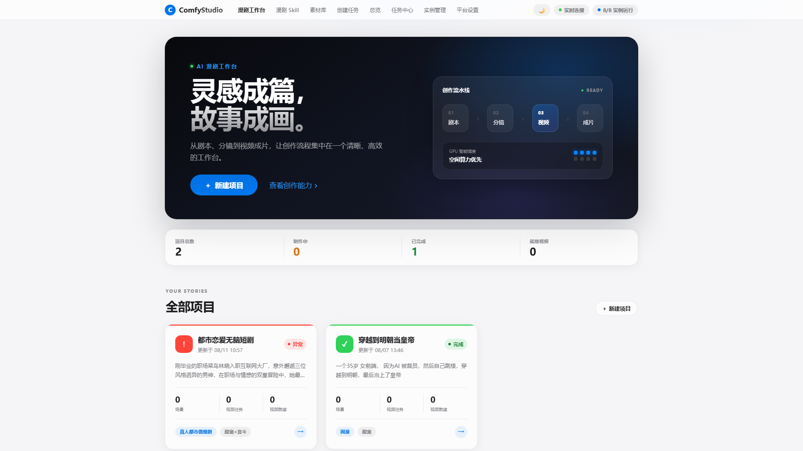
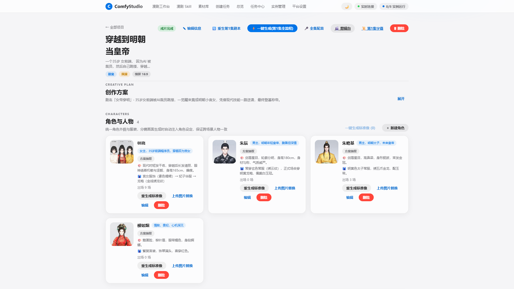
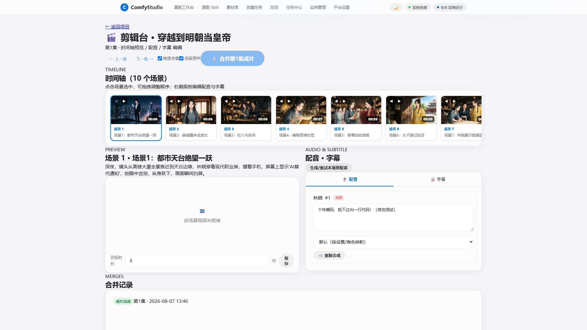
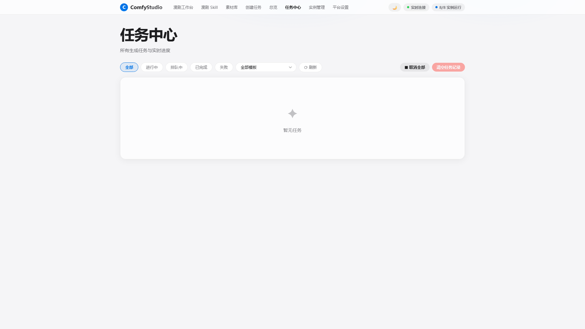
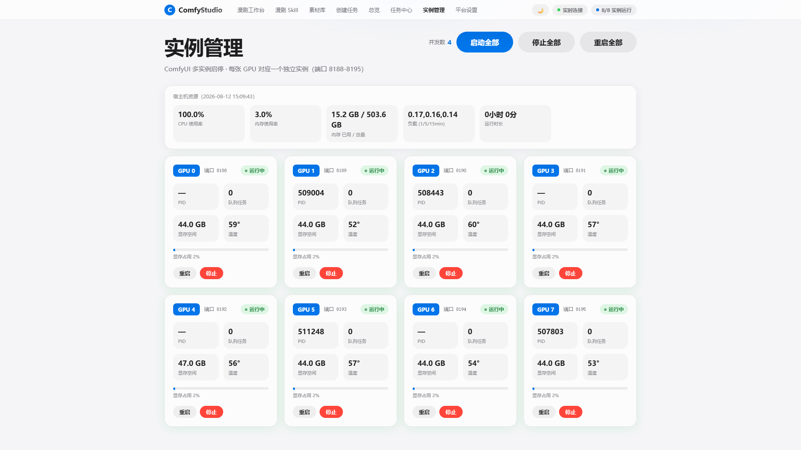
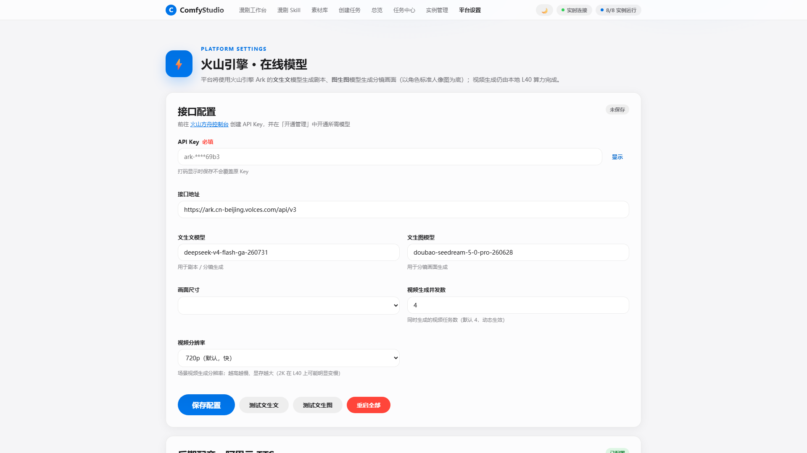
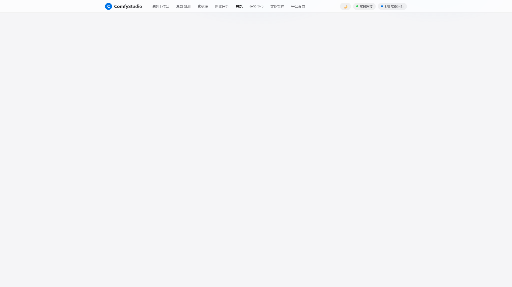

[简体中文](README.md) | [English](README.en.md)

<p align="center">
  <a href="https://hequan2017.github.io/new-aigc-comfyui-minimax-h3/"><strong>🌐 在线预览前端</strong></a>
  ·
  <a href="https://github.com/hequan2017/new-aigc-comfyui-minimax-h3/actions/workflows/deploy-pages.yml">查看构建状态</a>
</p>

# ComfyStudio · ComfyUI 多卡管理控制平台

[](LICENSE)
[](backend/go.mod)
[](frontend/package.json)

ComfyStudio 是一个基于 **Go + Vue3** 的 ComfyUI 多卡管理平台：管理 **8×NVIDIA L40** 算力节点，内置 **MiniMax H3** 工作流（文生视频 / 图生视频 / 首尾帧 / 参考视频 / 角色锁定），自动把任务调度到最空闲的 GPU，前端实时展示**节点级生成进度**与显卡占用，生成结果在线预览并解析视频元数据。

平台还内置 **AI 漫剧工作台**：一条流水线完成「创作方案 → 分集剧本 → 分镜画面 → 场景视频 → 合并成片」的漫剧制作，支持**多集制作**、**角色资产库**（跨场景人物一致）、**道具/场景资产库**（跨分镜道具与环境一致）、**角色音色绑定与 TTS 配音**（阿里云百炼）、**SRT 字幕**。

**适合谁**：手里有单机多卡 GPU 服务器、想批量生产 MiniMax H3 视频（短剧 / 漫剧 / 营销素材）的内容团队；也适合想在一套界面里管完「任务调度 + 素材 + 剧本 + 配音」全流程的独立创作者。

## ✨ 功能特性

### 平台基础

| 能力 | 说明 |
|---|---|
| 多卡调度 | 8×L40（卡数可配），任务自动分配到**队列最短 + 显存最闲**的 GPU |
| 实时进度 | WS 推送 ComfyUI 节点级进度（`progress_state`），按模板节点加权汇总，生成中封顶 99% |
| 工作流模板 | 5 个 MiniMax H3 内置模板：t2v / i2v / 首尾帧 / ref2v / 角色锁定（ref2v 精简版），占位符渲染 + 复数素材展开 + 自动节点裁剪 |
| 实例管理 | 单实例启停/重启（SSH 调 `start-multi-gpu.sh`）、一键启停/重启全部（异步） |
| GPU 看板 | 8 卡温度/功耗/显存/利用率/进程实时监控（nvidia-smi，默认 3s 采集） |
| 任务管理 | 列表筛选 / 取消 / 重新入队 / 重试 / 一键取消全部 / 清空已结束任务 |
| 任务自动恢复 | 后台循环 reconcile 卡死的 `running`/`queued` 任务；history 丢失时从 `output_workers/gpuN/` 兜底恢复结果 |
| 素材库 | 场景画面生成成功自动入库 + 手动上传管理 |
| 结果预览 | 在线预览（HTTP Range 拖动）+ 下载，MP4/图片元数据纯 Go 解析，不依赖 ffprobe |
| 平台设置 | 火山引擎 Ark（文生文/文生图）+ 阿里云百炼（TTS）API Key/模型配置，支持连通性测试，API Key 打码回显 |
| 并发闸门 | 全局视频生成并发 `video_concurrency`（默认 4）与分辨率 `video_resolution` 平台可调 |
| 模拟模式 | `simulate: true` 时按模板参考耗时模拟进度，无需 GPU 即可体验全流程 |

### AI 漫剧工作台

| 能力 | 说明 |
|---|---|
| 一键流水线 | 创作方案 → 剧本 → 分镜画面 → 场景视频 → 合并成片，服务重启可恢复 |
| 多集制作 | 创作方案规划目标集数，按集生成剧本/场景，SRT 字幕按集下载 |
| 角色资产库 | 角色卡（trait/style/标准像）自动抽取，重复抽取幂等；标准像支持文生图生成或上传，ref2v 锁角色保证跨场景一致 |
| 道具/场景资产 | 关键道具与主要场景自动建卡 + 参考图（生成或上传），分镜画面按 `location`/`props` 注入参考图锁定外观 |
| 一致性门控 | 分镜画面前置等待引用资产参考图就绪，视频阶段等待全部资产参考图就绪 |
| 角色锁定视频 | 有标准像走 ref2v / ref2v_single（分镜画面 + 主角标准像 2 图锁身份），无角色自动回退 i2v |
| 角色音色绑定 | 预设音色，或上传 10~20 秒参考语音经 `qwen-voice-enrollment` 注册复刻音色，全剧配音一致 |
| TTS 配音 | 阿里云百炼 `qwen3-tts-flash`（男/女声 + 角色音色映射）合成对白，支持单条重配音 |
| SRT 字幕 | 按真实音频时长生成时间轴（配音未就绪时按场景时长占位），UTF-8 BOM 兼容 Windows 播放器 |
| 场景编辑器 | 场景排序、时长调整、对白编辑、单场景画面/视频重新生成与取消 |
| 视频合并 | ffmpeg 按场景顺序 concat 拼接成片并保留音轨（libx264/AAC），支持单集合并与全部合并 |
| Skills 页 | 漫剧创作全链路方法论展示，内置微短剧剧本创作 Skill（题材/开篇/付费卡点/节奏/反派等参考文档） |

## 🛠 技术栈

| 端 | 技术 |
|---|---|
| 后端 | Go 1.25 + Gin v1.12 + GORM v1.31（SQLite，glebarez 纯 Go 驱动）+ gorilla/websocket v1.5 + pkg/sftp v1.13 |
| 前端 | Vue 3.5 + Vite 6 + Pinia 2 + Vue Router 4 + axios（无 UI 库，黑白主题切换） |
| 数据库 | SQLite（`/opt/comfyui-console/data/console.db`） |
| 推理 | ComfyUI（内置 `nodes_minimax_h3.py` MiniMax H3 模型实现，8×NVIDIA L40 裸进程） |
| 云服务 | 火山引擎 Ark（deepseek-v4 文生文 / doubao-seedream-5.0 文生图）、阿里云百炼（qwen3-tts-flash / qwen-voice-enrollment） |
| 部署 | 单二进制（前端 embed），Docker / 裸进程两种方式 |

## 🚀 快速开始

### 部署形态

| 形态 | 说明 | 适用 |
|---|---|---|
| console 容器 + ComfyUI 裸进程（默认） | console 跑 Docker（:18000），ComfyUI 实例由宿主机 `start-multi-gpu.sh` 管理，console 经 SSH/SFTP 操作 | 生产（推荐） |
| 全容器 | `comfy.mode: docker`，console 经 SSH 在宿主执行 `docker compose` 管理 `comfyui-gpu{N}` 容器（CDI 绑卡） | 容器化隔离 |
| 本地模式 | `comfy.mode: local`，`remote.host` 留空 | 单机开发测试 |

**环境要求**：Linux + NVIDIA GPU（默认 8 卡，可调）、Docker + compose v2、conda（miniconda3）、MiniMax H3 模型权重。

### 1. 部署 ComfyUI 与模型权重

```bash
git clone https://github.com/hequan2017/new-aigc-comfyui-minimax-h3.git
cd new-aigc-comfyui-minimax-h3

conda create -n comfyenv python=3.11 -y          # 依赖由 deploy.sh 增量安装
mkdir -p /opt/comfyUI && cp -r comfyui/* /opt/comfyUI/
mkdir -p /opt/comfyUI/models/{diffusion_models,text_encoders,vae}
scp shell/start-multi-gpu.sh root@<服务器IP>:/opt/comfyUI/start-multi-gpu.sh   # 按实际路径/卡数修改脚本头部
```

MiniMax H3 共需 **5 个权重文件**（文件名严格一致，fp8 权重加载时自动量化）：

| 权重文件 | 放置目录 | 用途 |
|---|---|---|
| `minimax_h3_fl2va_bf16.safetensors` | `models/diffusion_models/` | 文生视频 / 图生视频 / 首尾帧 DiT |
| `minimax_h3_ref2va_bf16.safetensors` | `models/diffusion_models/` | 参考视频（ref2v）DiT |
| `qwen3vl_32b_minimax_h3_bf16.safetensors` | `models/text_encoders/` | Qwen3-VL-32B 文本/视觉编码器 |
| `minimax_h3_video_vae_fp16.safetensors` | `models/vae/` | 视频 VAE |
| `minimax_h3_audio_vae_fp32.safetensors` | `models/vae/` | 音频 VAE（32kHz） |

> H3 是视频+音频联合生成模型，一次采样同时产出视频与音轨；帧数对齐 `17k+5` 网格（124~362 帧 ≈ 5~15 秒，24fps）；fp8 量化下单实例约需 22~24GB 显存。

### 2. 生成配置

```bash
cp backend/config.yaml.example backend/config.yaml
```

```yaml
remote:
  host: "<算力节点IP>"        # 为空时按本地模式运行
  port: 22
  user: root
  private_key: "/opt/comfyui-console/ssh_key"   # 私钥优先于密码
comfy:
  comfy_dir: /opt/comfyUI   # 与宿主机实际目录一致
simulate: false
```

常用配置项（完整见 `backend/config.yaml.example`）：

| 配置项 | 默认值 | 说明 |
|---|---|---|
| `server.addr` | `0.0.0.0:18000` | 平台监听地址 |
| `comfy.gpu_count` | `8` | GPU 实例数量 |
| `comfy.base_port` | `8188` | 实例起始端口（每 GPU 递增 1，8188~8195） |
| `comfy.reserve_vram` | `6` | 每实例预留显存（GB） |
| `comfy.mode` | `ssh` | `ssh` / `docker` / `local` |
| `storage.db_path` | `/opt/comfyui-console/data/console.db` | SQLite 路径 |
| `gpu.monitor_interval_seconds` | `3` | GPU 监控采集间隔 |
| `simulate` | `false` | 模拟模式（无 GPU 验证全流程） |

### 3. 一键部署（Docker）

```bash
bash deploy.sh               # git pull → conda 依赖 → 构建镜像 → 启动 → 健康检查
bash deploy.sh --no-gpu      # 无 GPU / 未装 toolkit 时
```

部署完成后浏览器访问 `http://<服务器IP>:18000`，验证：

```bash
curl http://127.0.0.1:18000/api/health
cd /opt/comfyUI && bash start-multi-gpu.sh status
```

**在线预览（GitHub Pages）**：推送到 `main` 后 Actions 自动构建前端并发布到 [https://hequan2017.github.io/new-aigc-comfyui-minimax-h3/](https://hequan2017.github.io/new-aigc-comfyui-minimax-h3/)，无需配置仓库 Secret；Pages 为静态预览（Hash 路由，无后端响应），完整功能请本地部署。

**运维**：升级发版重跑 `bash deploy.sh`（每次强制重建镜像）；日志 `docker logs -f console`；数据备份 `/opt/comfyui-console/data/` 即可。

## 📁 目录结构

```
├── backend/                  # Go 后端（单二进制，前端 embed）
│   ├── config.yaml.example   # 配置模板
│   └── internal/
│       ├── api/router.go     # 路由
│       ├── models/           # Task/Template/Project/Scene/Character/Asset/Material 等
│       └── service/          # 任务调度/漫剧流水线/火山 Ark/阿里云 TTS/SSH/WS/GPU 监控
│           └── templates/    # 5 个工作流模板 JSON (embed)
├── comfyui/                  # ComfyUI fork（含 MiniMax H3 模型实现）
├── frontend/                 # Vue3 前端（Dashboard/Tasks/Instances/Projects/Materials/Skills/Settings）
├── shell/start-multi-gpu.sh  # ComfyUI 多卡实例启停脚本（部署到宿主机使用）
├── docker-compose.yml        # console 容器编排
├── Dockerfile                # 多阶段构建（前端 embed + Go 单二进制）
└── deploy.sh                 # 一键部署
```

## 📸 截图/演示

<p align="center">
  
  
  <br/>
  
  
  <br/>
  
  
  <br/>
  
</p>

## 🔗 相关项目

- [minimax-h3-manager](https://github.com/hequan2017/minimax-h3-manager) —— 同作者的 MiniMax-H3 统一推理服务：vllm-omni 双后端（FL2VA / Ref2VA）+ FastAPI 网关 + 中文 Web 控制台，以标准 Video Generation API 形式对外提供 H3 生成能力，与本平台的 ComfyUI 推理路径互补。

## 📄 开源协议

[MIT License](LICENSE) © [hequan2017](https://github.com/hequan2017)
